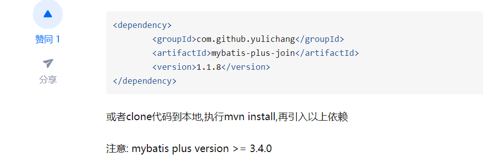
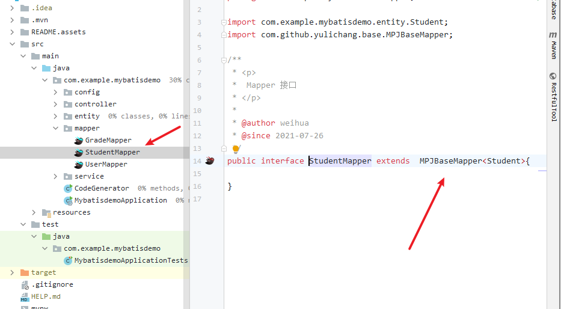
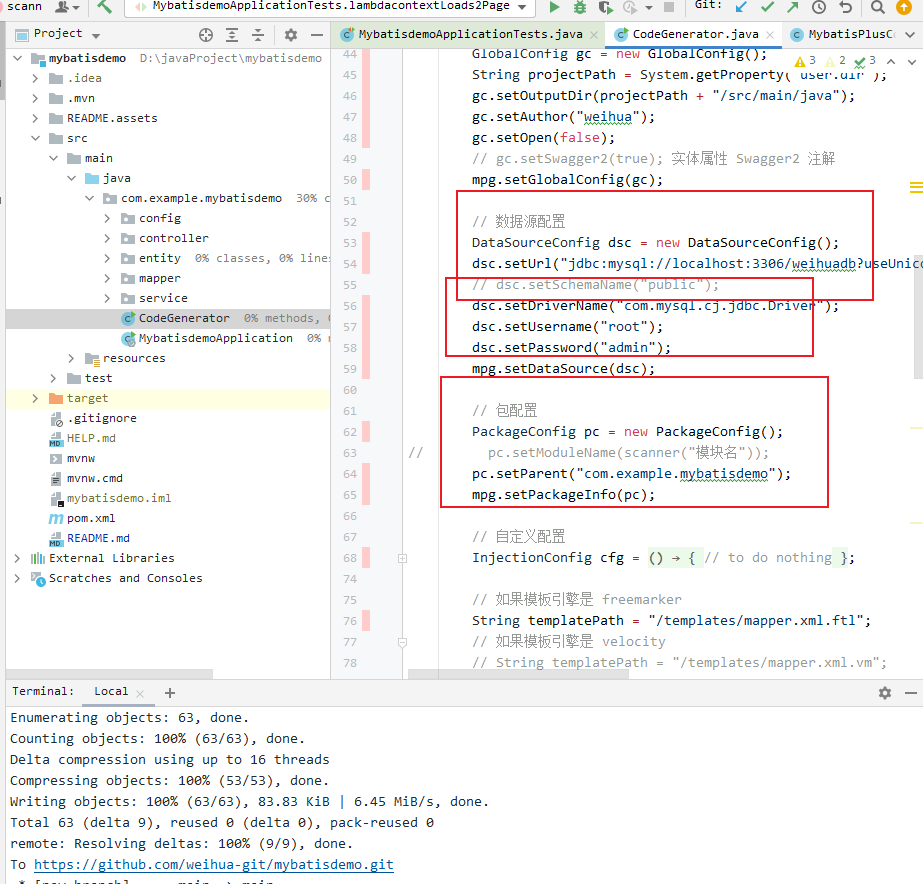

# 记录

## mybatis plus

https://mp.baomidou.com/guide/wrapper.html#abstractwrapper

```
#条件构造器
说明:

以下出现的第一个入参boolean condition表示该条件是否加入最后生成的sql中，例如：query.like(StringUtils.isNotBlank(name), Entity::getName, name) .eq(age!=null && age >= 0, Entity::getAge, age)
以下代码块内的多个方法均为从上往下补全个别boolean类型的入参,默认为true
以下出现的泛型Param均为Wrapper的子类实例(均具有AbstractWrapper的所有方法)
以下方法在入参中出现的R为泛型,在普通wrapper中是String,在LambdaWrapper中是函数
```


```
 System.out.println(("----- selectAll method test ------"));
        String name = "";
        Integer age = 1;
        // 进行具体条件构造
        userService.list(
                new LambdaQueryWrapper<User>()
                        .select(User::getName)
                        .eq(StringUtils.isNotBlank(name), User::getName, name)
                        .gt(age != null && age >= 0, User::getAge, 18)
        );
```


## mybatis plus 进行连表查询

https://zhuanlan.zhihu.com/p/368591782

**注意**




```
  <!--   用于连表查询     -->
        <dependency>
            <groupId>com.github.yulichang</groupId>
            <artifactId>mybatis-plus-join</artifactId>
            <version>1.1.8</version>
        </dependency>
```



```
/**
 * <p>
 *  Mapper 接口
 * </p>
 *
 * @author weihua
 * @since 2021-07-26
 */
public interface StudentMapper extends  MPJBaseMapper<Student>{

}

```


```java
@Resource
    private StudentMapper studentMapper;


    // 简单的连表查询
    @Test
    void contextLoads2() {


        List<StudentVo> studentVos = studentMapper.selectJoinList(StudentVo.class,
                new MPJQueryWrapper<Student>()
                        .select("gr.gradeName", "t.stuName")
                        .leftJoin("grade gr on t.gradeId = gr.Id")
        );


    }

    @Test
    void testJoin() {


        studentMapper.selectJoinPage(new Page<>(1, 2), StudentVo.class,
                new MPJQueryWrapper<Student>()
                        .select("gr.gradeName", "t.stuName")
                        .leftJoin("grade gr on t.gradeId = gr.Id"));

    }

    // lambda
    @Test
    void lambdacontextLoads2() {

        String name = "test";
        studentMapper.selectJoinList(StudentVo.class,
                new MPJLambdaWrapper<>()
                        .selectAll(Student.class)
                        .selectAs(Grade::getGradeName, StudentVo::getFakeyouName)
                        .leftJoin(Grade.class, Grade::getId, Student::getGradeId)
                        .eq(Grade::getId, 1)
                        .like(StringUtils.isNotBlank(name), Student::getStuName, "1")

        );

    }

    @Test
    void lambdacontextLoads2Page() {

        String name = "test";
        studentMapper.selectJoinPage(new Page<>(1,10),StudentVo.class,
                new MPJLambdaWrapper<>()
                        .selectAll(Student.class)
                        .selectAs(Grade::getGradeName, StudentVo::getFakeyouName)
                        .leftJoin(Grade.class, Grade::getId, Student::getGradeId)
                        .eq(Grade::getId, 1)
                        .like(StringUtils.isNotBlank(name), Student::getStuName, "1")

        );

    }
```


## 生成代码



```
<dependency>
    <groupId>com.baomidou</groupId>
    <artifactId>mybatis-plus-generator</artifactId>
    <version>3.4.0</version>
</dependency>

<dependency>
    <groupId>org.freemarker</groupId>
    <artifactId>freemarker</artifactId>
    <version>2.3.28</version>
</dependency>
```


```


import com.baomidou.mybatisplus.core.exceptions.MybatisPlusException;
import com.baomidou.mybatisplus.core.toolkit.StringPool;
import com.baomidou.mybatisplus.core.toolkit.StringUtils;
import com.baomidou.mybatisplus.generator.AutoGenerator;
import com.baomidou.mybatisplus.generator.InjectionConfig;
import com.baomidou.mybatisplus.generator.config.*;
import com.baomidou.mybatisplus.generator.config.po.TableInfo;
import com.baomidou.mybatisplus.generator.config.rules.NamingStrategy;
import com.baomidou.mybatisplus.generator.engine.FreemarkerTemplateEngine;

import java.util.ArrayList;
import java.util.List;
import java.util.Scanner;

// 演示例子，执行 main 方法控制台输入模块表名回车自动生成对应项目目录中
public class CodeGenerator {

    /**
     * <p>
     * 读取控制台内容
     * </p>
     */
    public static String scanner(String tip) {
        Scanner scanner = new Scanner(System.in);
        StringBuilder help = new StringBuilder();
        help.append("请输入" + tip + "：");
        System.out.println(help.toString());
        if (scanner.hasNext()) {
            String ipt = scanner.next();
            if (StringUtils.isNotBlank(ipt)) {
                return ipt;
            }
        }
        throw new MybatisPlusException("请输入正确的" + tip + "！");
    }

    public static void main(String[] args) {
        // 代码生成器
        AutoGenerator mpg = new AutoGenerator();

        // 全局配置
        GlobalConfig gc = new GlobalConfig();
        String projectPath = System.getProperty("user.dir");
        gc.setOutputDir(projectPath + "/src/main/java");
        gc.setAuthor("weihua");
        gc.setOpen(false);
        // gc.setSwagger2(true); 实体属性 Swagger2 注解
        mpg.setGlobalConfig(gc);

        // 数据源配置
        DataSourceConfig dsc = new DataSourceConfig();
        dsc.setUrl("jdbc:mysql://localhost:3306/weihuadb?useUnicode=true&useSSL=false&characterEncoding=utf8&serverTimezone=Asia/Shanghai");
        // dsc.setSchemaName("public");
        dsc.setDriverName("com.mysql.cj.jdbc.Driver");
        dsc.setUsername("root");
        dsc.setPassword("admin");
        mpg.setDataSource(dsc);

        // 包配置
        PackageConfig pc = new PackageConfig();
//        pc.setModuleName(scanner("模块名"));
        pc.setParent("com.example.mybatisdemo");
        mpg.setPackageInfo(pc);

        // 自定义配置
        InjectionConfig cfg = new InjectionConfig() {
            @Override
            public void initMap() {
                // to do nothing
            }
        };

        // 如果模板引擎是 freemarker
        String templatePath = "/templates/mapper.xml.ftl";
        // 如果模板引擎是 velocity
        // String templatePath = "/templates/mapper.xml.vm";

        // 自定义输出配置
        List<FileOutConfig> focList = new ArrayList<>();
        // 自定义配置会被优先输出
        focList.add(new FileOutConfig(templatePath) {
            @Override
            public String outputFile(TableInfo tableInfo) {
                // 自定义输出文件名 ， 如果你 Entity 设置了前后缀、此处注意 xml 的名称会跟着发生变化！！
                return projectPath + "/src/main/resources/mapper/" + pc.getModuleName()
                        + "/" + tableInfo.getEntityName() + "Mapper" + StringPool.DOT_XML;
            }
        });
        /*
        cfg.setFileCreate(new IFileCreate() {
            @Override
            public boolean isCreate(ConfigBuilder configBuilder, FileType fileType, String filePath) {
                // 判断自定义文件夹是否需要创建
                checkDir("调用默认方法创建的目录，自定义目录用");
                if (fileType == FileType.MAPPER) {
                    // 已经生成 mapper 文件判断存在，不想重新生成返回 false
                    return !new File(filePath).exists();
                }
                // 允许生成模板文件
                return true;
            }
        });
        */
        cfg.setFileOutConfigList(focList);
        mpg.setCfg(cfg);

        // 配置模板
        TemplateConfig templateConfig = new TemplateConfig();

        // 配置自定义输出模板
        //指定自定义模板路径，注意不要带上.ftl/.vm, 会根据使用的模板引擎自动识别
        // templateConfig.setEntity("templates/entity2.java");
        // templateConfig.setService();
        // templateConfig.setController();

        templateConfig.setXml(null);
        mpg.setTemplate(templateConfig);

        // 策略配置
        StrategyConfig strategy = new StrategyConfig();
        strategy.setNaming(NamingStrategy.underline_to_camel);
        strategy.setColumnNaming(NamingStrategy.underline_to_camel);
//        strategy.setSuperEntityClass("你自己的父类实体,没有就不用设置!");
        strategy.setEntityLombokModel(true);
        strategy.setRestControllerStyle(true);
        // 公共父类
//        strategy.setSuperControllerClass("你自己的父类控制器,没有就不用设置!");
        // 写于父类中的公共字段
        strategy.setSuperEntityColumns("id");
        strategy.setInclude(scanner("表名，多个英文逗号分割").split(","));
        strategy.setControllerMappingHyphenStyle(true);
        strategy.setTablePrefix(pc.getModuleName() + "_");
        mpg.setStrategy(strategy);
        mpg.setTemplateEngine(new FreemarkerTemplateEngine());
        mpg.execute();


    }
}
```

